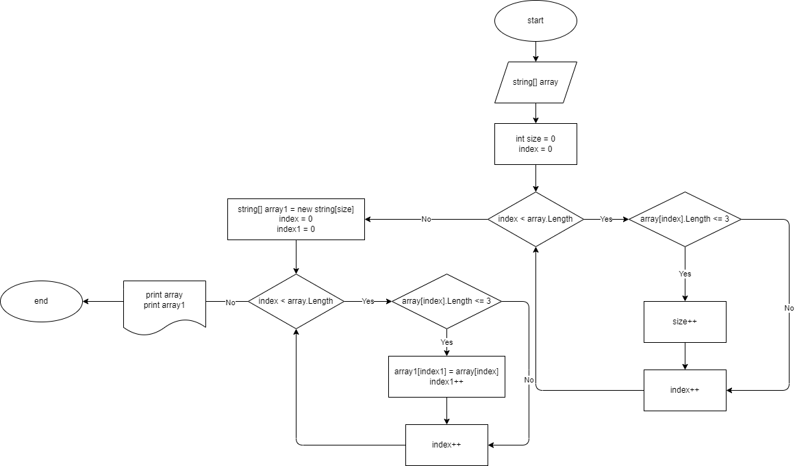

# Описание решения задачи для проверочной работы

## Условие задачи

Написать программу, которая из имеющегося массива строк формирует массив из строк, длина которых меньше либо равна 3 символа. Первоначальный массив можно ввести с клавиатуры, либо задать на старте выполнения алгоритма. При решении задачи не рекомендуется пользоваться коллекциями, лучше обойтись исключительно массивами.

## Решение задачи

## 1. Определение размерности исходного массива

Перед созданием массива нужно узнать его размерность. Вводим две переменные:

* *size* = 0 - обозначает размерность массива
* *index* = 0 - переменная увеличивается на 1 каждый ход цикла "перебирая" все значения элементов массива.

Далее вводим цикл для нахождения элементов, длина которых меньше либо равна 3 символа:

1. Пока переменная index меньше длины массива. Иначе переходим к следующему этапу.
2. Если длина элемента массива с индексом index меньше либо равна 3 символа, увеличиваем size на 1.
3. Увеличиваем index на 1. Возвращаемся к пункту 1.